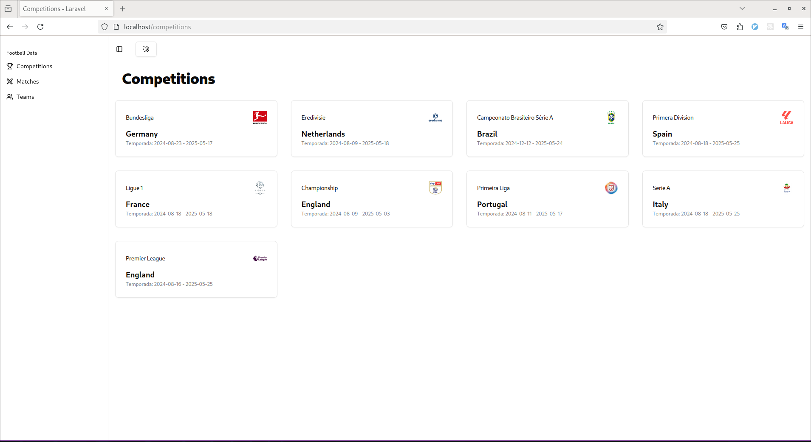
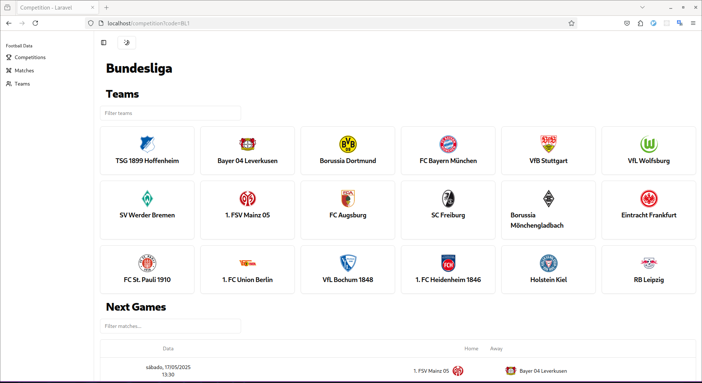

# Football-api

## Overview

A web application built with Laravel, Inertia.js, Vue 3, and Sail, designed to fetch and display football data from a third-party API. It features TanStack Table, ShadCN Vue, caching with Redis, integration via Saloon PHP, and structured models using Spatie Laravel Data.

## Screenshots

### Competitions list



### Competition



## Requirements

- Docker and Docker Compose installed.
- Account on [Football Data](https://www.football-data.org/) to obtain an API key.

## Installation

1. Clone the repository:

    ```sh
    git@github.com:amdlemos/football-api.git
    cd football-api
    ```

2. Install Composer dependencies:

    ```sh
    docker run --rm \
        -u "$(id -u):$(id -g)" \
        -v "$(pwd):/var/www/html" \
        -w /var/www/html \
        laravelsail/php84-composer:latest \
        composer install --ignore-platform-reqs
    ```

3. Copy the environment file and configure the API key:

    ```sh
    cp .env.example .env
    ```

    Edit the `.env` file and add the API key:

    ```env
    FOOTBALL_DATA_API_KEY=yourapikeyhere
    ```

4. Start the application:
    ```sh
    vendor/bin/sail up
    ```

## Access

- Application: [localhost](http://localhost)
- Laravel Telescope: [localhost/telescope](http://localhost/telescope)
- Laravel Pulse: [localhost/pulse](http://localhost/pulse)
